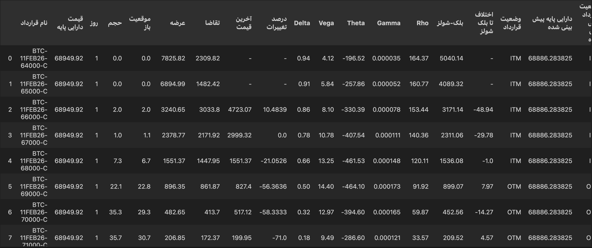
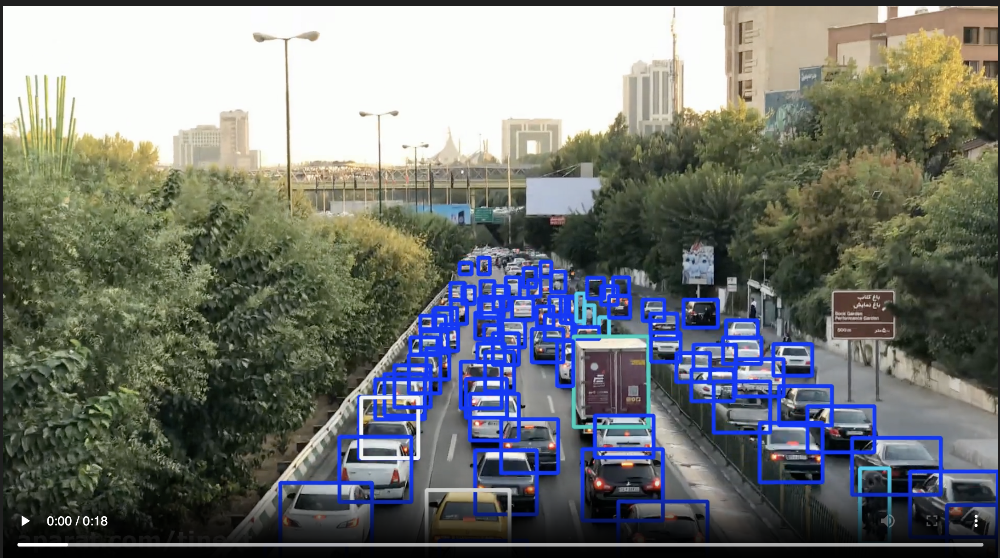

# Hi there, I'm Fatemeh Naeemi 👋
### Python Developer | Aspiring Machine Learning Engineer

I am a passionate Python Developer with over 3 years of professional experience, specializing in **Web Scraping**, **Data Engineering**, and **Computer Vision**. Currently, I am deeply focused on mastering **Machine Learning** and building intelligent systems that solve real-world problems.

- 🔭 I’m currently working on: Fine-tuning **YOLO** models and exploring **Time-series forecasting (LSTM)**.
- 🌱 I’m currently learning: Advanced Deep Learning and Deployment of ML models.
- ⚡ Fun fact: I enjoy bypassing complex anti-bot systems to unlock the power of data!

---

## 🛠 Tech Stack
- **Languages:** 
- **Data & ML:**    
- **Scraping:**  Beautiful Soup, Requests
- **Tools:**  RoboFlow

---

## 🚀 Portfolio Highlights

### 1. Crypto Options Analytics & Forecasting Engine
**Tech Stack:** `Python`, `Pandas`, `NumPy`, `Prophet (Meta)`, `Deribit API`, `SciPy`
- **Automated Data Pipeline:** Fetches real-time Option Chain and Futures data from **Deribit API**.
- **Financial Engineering:** Implemented the **Black-Scholes Model** to calculate Greeks (**Delta, Gamma, Theta, Vega, Rho**) for professional valuation.
- **Predictive Analytics:** Integrated **Meta's Prophet** model to forecast underlying asset prices and determine "Predicted Moneyness" at expiration.
- **Advanced Data Manipulation:** Performs complex merging and vectorized operations to structure a professional trading dashboard.

  

### 2. Real-time Traffic Monitoring & Object Detection
**Tech Stack:** `Python`, `YOLO (Ultralytics)`, `Computer Vision`, `OpenCV`, `Roboflow`
- **Model Customization:** Fine-tuned the **YOLO** architecture on custom datasets for high-density vehicle detection in complex traffic scenarios.
- **Data Pipeline:** Managed end-to-end data labeling and augmentation in **Roboflow** for robustness against diverse lighting conditions.
- **Industrial Application:** Adapted detection logic for industrial automation, specifically for material tracking in a manufacturing environment.

  

### 3. Advanced Anti-Bot Web Scraping & Data Engineering
**Tech Stack:** `Python`, `Selenium`, `Pandas`, `Openpyxl`, `Chrome DevTools Protocol`
- **Anti-Detection Mechanism:** Implemented session mirroring and profile cloning to bypass sophisticated anti-bot measures on international academic portals.
- **Resilient Navigation:** Developed robust pagination and `GET-fallback` logic to ensure continuous extraction across 5+ countries (UK, Canada, Finland, etc.).
- **Data Normalization:** Built a specialized engine to clean and standardize multi-currency grant information into a structured database.

### 4. LLM-based Legal Assistant (Prompt Engineering & AI Logic)
**Tech Stack:** `Python`, `OpenAI API`, `Prompt Engineering`, `LLM Conversation Design`
- **Prompt Engineering:** Designed system and user prompts to control tone, structure, and constraints of LLM responses.
- **Multi-step Conversation Flow:** Implemented guided, step-by-step legal interviews with intelligent follow-up questions.
- **Structured Output Parsing:** Transformed free-form LLM responses into concise, lawyer-ready legal case summaries.
- **AI Logic Focus:** Worked on LLM behavior design and conversation logic, collaborating with backend developers for integration.

> **Note:** Due to Non-Disclosure Agreements (NDAs), the four projects above are maintained in private repositories. Detailed architecture discussions are welcome during interviews.

### 5. PromptShield — Prompt Injection Detection & Adversarial Evaluation
**Tech Stack:** `Python`, `Regex`, `scikit-learn`, `TF-IDF`, `Logistic Regression`, `pytest` — **[Source Code →](https://github.com/fati9731/promptshield)**
- **Layered Rule Engine:** Detects instruction override, system and developer prompt extraction, role manipulation, and jailbreak attempts, with severity-weighted scoring. Each clause is judged independently, so an attack cannot hide behind an innocent sentence beside it, and cross-sentence rules catch attacks split across two clauses.
- **False-Positive Control:** Every rule carries a guard separating *performing* an attack from *discussing* one, so security documentation is never flagged — the property that lets the patterns stay broad. Each rule is pinned in tests from both sides: an attack it must catch, and a description of that same attack it must ignore.
- **Normalization Before Matching:** Paraphrases and synonyms are rewritten into a canonical form before the rules run, closing gaps that no amount of additional pattern-writing could reach.
- **Labelled Corpus & Data Auditing:** Built a labelled prompt corpus from multiple independently written sources, with automated checks for duplicates and for the same prompt carrying contradictory labels across files — the errors that silently invalidate every metric built on top of them.
- **Machine-Learning Baseline:** Trained a TF-IDF + logistic regression classifier against the rule engine to test where pattern matching structurally cannot generalize, then combined the two and measured what each contributes and what the combination costs.
- **Detected and Corrected a Data Leak:** Found that merging the labelled sources had placed most of the evaluation set into the training half, making the first model score meaningless. Rebuilt the evaluation as leave-one-source-out, and swept the decision threshold entirely on out-of-fold predictions so the fix could not quietly reintroduce the leak.
- **Single-Use Final Holdout:** Wrote a fresh labelled holdout *after* development stopped and scored it once. The harness verifies its own premise — it hashes the holdout and refuses to run if any prompt overlaps the development data — rather than asserting that the data is unseen.
- **Reported the Result That Hurt:** The final holdout showed materially worse generalization than cross-validation had suggested, because held-out *files* written by one author are not a held-out *distribution*. Published the lower number with that explanation instead of the flattering one, and made the resulting false-positive rate the project's next priority.

---

## 📬 Contact Me
- **LinkedIn:** [linkedin.com/in/fatemeh-naeemi-5189431b9](https://www.linkedin.com/in/fatemeh-naeemi-5189431b9)
- **Email:** fati.naeeme79@gmail.com
